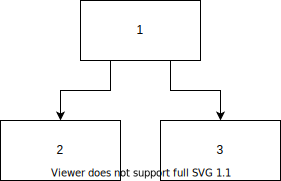

# Diagrams in Markdown

We have two alternative #recipe for displaying diagrams in markdown:

- [Diagrams in Markdown](#diagrams-in-markdown)
  - [Mermaid](#mermaid)
  - [Draw.io](#drawio)
    - [Using Draw.io](#using-drawio)

## Mermaid

You can use [Mermaid](https://marketplace.visualstudio.com/items?itemName=bierner.markdown-mermaid) plugin to draw and preview diagrams in your content.

⚠️ Be aware that Mermaid diagrams don't automatically get rendered in published Foams in [[publish-to-github-pages]], and would require you to eject to another static site generation approach that supports Mermaid plugins.

## Draw.io

[Draw.io](https://marketplace.visualstudio.com/items?itemName=hediet.vscode-drawio) extension allows you to create, edit, and display your diagrams without leaving Visual Studio Code. The `.drawio.svg` or `.drawio.png` files can be automatically embedded and displayed in published Foams, no export needed. FYI, the diagram below was made using Draw.io! You can check the diagram [here](../../static/images/diagram-drawio-demo.drawio.svg).

### Using Draw.io

1. Install [Draw.io](https://marketplace.visualstudio.com/items?itemName=hediet.vscode-drawio) VS Code extension.
2. Create a new `*.drawio.svg` or `*.drawio.png` file.
3. Start drawing your diagram. Once you done, save it.
4. Embed the diagram file as you embedding the image file, for example: ``

[//begin]: # "Autogenerated link references for markdown compatibility"
[publish-to-github-pages]: ../publishing/publish-to-github-pages.md "GitHub Pages"
[//end]: # "Autogenerated link references"
